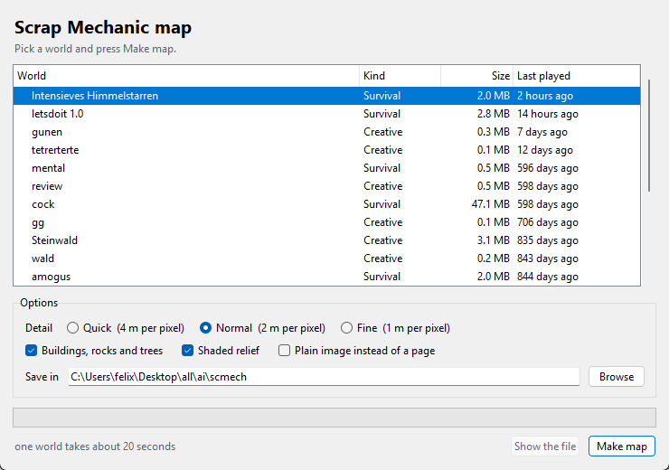
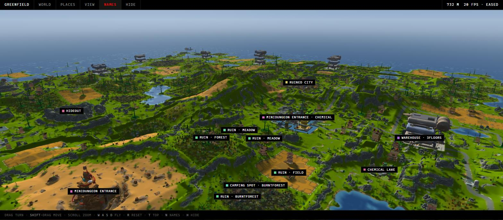
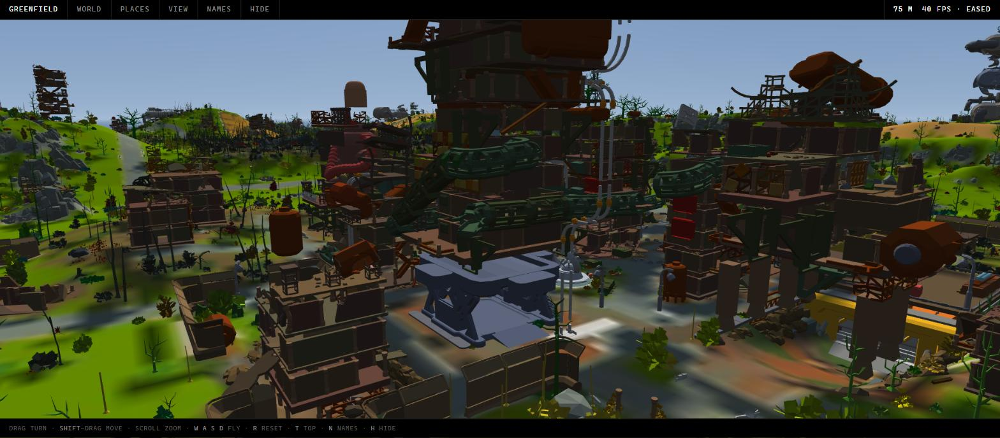
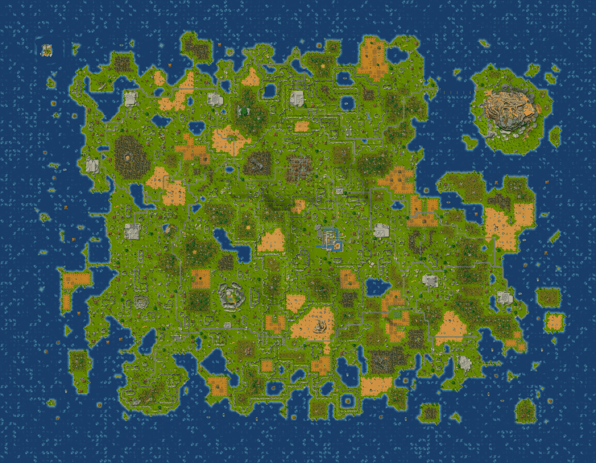
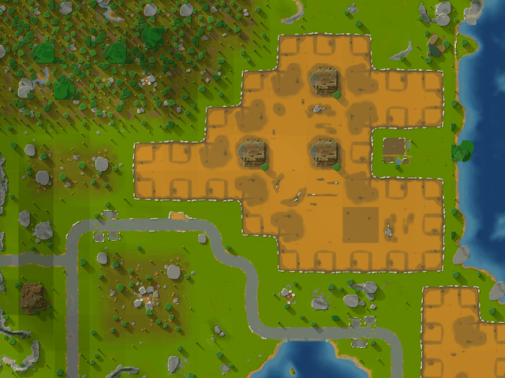
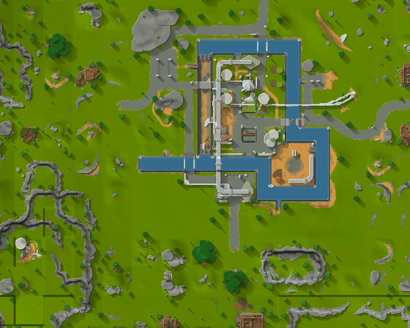

# Scrap Mechanic map

Makes a map of your Scrap Mechanic survival world — flat from above, or solid
and standing up so you can fly around it.

**Double-click `ScrapMap.exe`.** A window opens with your worlds already in it,
the one you played last picked out. Press **Make map** and it renders and opens
in your browser. Nothing to install, nothing to find, nothing to configure.



## New in 2.1 — the places in it

Both maps now know what is in your world and what it is called. A world lays
down eight hundred or so places, and **Places** lists every one: warehouses, the
silo district, the ruined city, the mechanic and schematic stations, chemical
plants, oil pools, minidungeon entrances, camping spots, and all twenty-one
builder quests by name — a Baguette, a Catapult, a Musicbox.

Tick a kind off in the legend and it goes; search and only what matches stays.
So *show me only the builder quests* is a question the map can now answer. Click
a place and the view goes there. Tick the box beside it and it is marked as one
you have been to, and it stays ticked when you open the page again.

The search runs over the objects as well: type `silo` and the world keeps its
silos and puts the rest away.

**A map opens without the names.** The pins say a place is there and will still
take you to it; they do not say what it is. So you can look at a world you have
not played — how the land lies, how much of it is water — without being told
where anything is. Press **Names**, or `N`, and everything is named.

**Places are read from the tiles themselves.** The generator does not scatter a
warehouse about; it lays down a `Warehouse_Exterior_2Floors_256_01` tile, and
the warehouse is what stands on it. So the tile under a cell names the place,
and grouping the cells each laying covers finds them all. Nothing is guessed and
nothing is hand-listed.

The page also got out of the way: five panels became one bar with three tabs,
all closed to start, and `H` hides even that. There is a Linux launcher now, and
the view hands back detail when it cannot keep up. See
[CHANGELOG.md](CHANGELOG.md) for the rest, including what was fixed.

## New in 2.0 — the world in three dimensions

Tick **3D** and the map stands up. The ground is a real surface at its real
height, the water sits where the world puts it, and every object the generator
placed is there as its own geometry at its own place, size and angle.



Fly down into it and a district reads as a district from the ground rather than
only from above — silos, warehouses, canals, ruins on their stilts, rock
outcrops, and undergrowth over all of it:



That is **641,727 objects** in the world above, every one the generator placed
down to the last shrub, out of 2.74 million placements — 99.95% of everything
in the world now has geometry, against 62% in the first cut of the 3D view.

Drag to turn, right-drag to move, scroll to zoom, `W A S D` to fly, `R` to reset
and `T` to look straight down. The sun moves round the compass and up the sky,
and the shadows move with it. It needs WebGL 2, which every current browser has.

### What changed since 1.x

- **The 3D view carries the world's real height.** It did not before: a
  rounding fault in the dry-water marker stretched every world's height range to
  a billion metres, which quantised the whole map flat. See *Water*, below.
- **Objects that were silently dropped now appear.** Collision meshes come in
  two formats and only one was read; a quarter of everything placed has no
  collision mesh at all; the kinematics had no catalogue entry. All fixed.
- **Detail now reaches the ground.** Quick, normal and fine gave the same ground
  mesh, because it was capped below all three. They are now 12, 6 and 3 metres
  per sample.
- **Shorelines stopped flickering** where the water surface and the land met.

The flat map is unchanged in character and picked up the same missing props.



Everything the world generator placed is drawn where it stands — roads,
warehouses, silos, ruins, fences, rocks and trees, each lit and casting a shadow
so you can read a place at a glance:



Points of interest are drawn from their own ground data rather than from the
coarse whole-tile grid, so a district arrives with its roads, yards and canals
rather than as a field with some pipes in it:



## Why this exists

Scrap Mechanic already has map tools, and good ones. The `cells.json` mappers
are how most people first saw their world from above, and the hand-made tile art
in them is lovely — someone sat down and drew every one of those tiles. This is
not meant to replace them or to compete with them. It takes a different road to
the same place, and the two are worth having for different reasons.

Those tools ask the game what it generated: you patch `terrain_overworld.lua`
and `tile_database.lua`, load the world once so it writes a `cells.json`, and the
page draws that dump against a library of tile images.

This one never runs the game. It reads the save and the game's own data files —
the terrain heightmaps, the material weights, the asset meshes — and draws the
ground and everything standing on it from those. Which buys less setup and a
tile for every tile, and costs the character of artwork someone chose by hand:
what you get here is computed, not drawn.

|                     | `cells.json` mappers          | this                            |
| ------------------- | ----------------------------- | ------------------------------- |
| Reads               | a dump from the running game  | the save and the game's files   |
| Setup               | patch two Lua files, load once | none                           |
| Look                | hand-drawn tile art           | computed from textures and meshes |
| Coverage            | the tiles that have art       | every tile in the world         |
| Serving             | a web server, or inline it     | one self-contained HTML file    |

If you want a map that looks the way an artist meant it to, use those. If you
want one that shows exactly what the generator put in your world, without setting
anything up, this is that.

## Requirements

Windows, and Scrap Mechanic installed. `ScrapMap.exe` carries its own Python,
numpy and Pillow, so there is nothing else to install.

To run it from the source instead, you need Python 3.8+ and you double-click
`Make map.bat`, which installs `numpy` and `Pillow` the first time if they are
missing.

### On Linux

Run `./make-map.sh` instead — same window, same command line, nothing to
configure. It finds Python, installs `numpy` and `Pillow` the first time, and
falls back to a virtual environment in `.venv` when the distribution refuses to
install into the system Python, which most now do. If `tkinter` is missing it
says which package to install rather than failing at a traceback.

Scrap Mechanic is a Windows game, so Steam runs it under Proton. That changes
where its files are but not what is in them: the saves are the same SQLite, the
tiles are the same tiles. The tool looks inside the game's Proton prefix —
`steamapps/compatdata/387990/pfx/drive_c/users/steamuser/AppData/...` — across
every Steam library, and handles the Flatpak and Debian install layouts, both
spellings of AppData that Wine keeps, and prefixes made before Proton settled
on the `steamuser` account name.

One thing that has no Windows equivalent: Linux filesystems care about case, and
the game's data files refer to each other in whatever case its exporter wrote,
which need not be the case the depot put on disk. Wine hides that from the game;
it does not hide it from a tool reading those files directly, where one wrong
letter silently costs a mesh, a texture, or a whole asset set. Paths that do not
resolve are therefore retried case-insensitively, which costs nothing whenever
they do.

To build the executable yourself:

```
python build_exe.py
```

That makes a throwaway virtual environment under `build/`, fetches PyInstaller
into it and cuts a 30 MB `ScrapMap.exe` from it, which opens its window about
two seconds after you double-click it. Nothing is installed into the Python you
use, and the environment it is cut from holds only what the tool imports.

## The window

Every save on the PC, newest first, with the one you last played picked out.
Detail runs from quick (4 m per pixel) through normal to fine (1 m per pixel,
about a minute and a half for a full world); you can turn off the structures or
the shading, write a plain image instead of a page or a 3D one you can fly
around, and choose where it lands. Detail sets how fine the ground is in 3D as
well — 12, 6 or 3 metres a sample — so fine is worth asking for there.
Pick several worlds and it does them one after another. It tells you roughly how
long it will take before you start, how far along it is while it runs, and the
same button stops it.

## Output

`<world>_map.html` beside `ScrapMap.exe` — a single self-contained file (the
image is embedded, so you can move it anywhere or send it to someone). Drag to
pan, scroll to zoom, `F` to fit, `1` for 100%. The readout shows cell and world
coordinates under the cursor, which is handy for `/teleport`, and every place in
the world is pinned on the map and listed under **Places** — click one to centre
on it, tick it to mark it found. `H` hides the page's own furniture. Ticks are
kept under the world's name, so renaming or moving the file does not lose them.

Ground colours come from the game's own terrain textures, so grass, sand, dirt
and rock read the way they do in game. Relief is hillshaded from the terrain
heightmap. Water is drawn where the world actually has water and nowhere else —
the sea, every lake, the pond inside a hideout, the canals around the silo
district — with chemical baths and oil pools drawn as what they are, and a dry
pit like the excavation mine left dry however far below the sea it goes.

## In three dimensions

`--3d`, or the checkbox in the window, writes `<world>_3d.html` instead: the
same map, standing up. Drag to turn, right-drag or `shift`-drag to move, scroll
to zoom, `W A S D` to fly, `R` to reset the view, `T` to look straight down and
`H` to put the page's own furniture away.
The sun moves round the compass and up and down the sky, the relief exaggerates
from a half to six times for a world that is mostly gentle, and the ground
detail comes down for a slower machine.

It is the same render, taken a step earlier. The flat map spends the world's
height on shading it into a picture; the 3D page keeps the height and lets the
graphics card do the shading instead. The ground colour goes up as a texture and
the ground itself as a mesh, built from the heightmaps the tiles carry — which
is the same data the game builds its ground from, at two metres a sample.
Water is a surface at the level the tiles put it, cut off exactly where the land
comes up through it, and the shadows are cast by the terrain rather than drawn
on, so moving the sun moves them.

### Every object as itself

What stands on the ground is not relief in a heightmap. Every object the world
generator placed goes in as its own geometry, at its own place, size and angle:
a warehouse is a box you can walk round, a silo is a cylinder twenty-six metres
up, a district reads as a district from the ground rather than only from above.

The shapes are the game's **collision meshes** — what the game itself collides
against. They are not the art it draws: no textures, fewer faces, and a tree is
a trunk and a cone rather than every leaf. What is here is the real shape of the
real object in the real place, painted the colour the placement says it is.

A collision mesh is written either as a plain `.obj` or as an FBX, and which one
is nothing to do with the asset — it is who exported it. So `fbx.py` reads that
format too, binary and text alike: without it the piers, the rubble piles, the
platforms and half the ruins in a world are placed and then quietly dropped,
which was two hundred of the six hundred kinds of thing a world stands up.

A quarter of everything a world places has no collision mesh at all, because a
player walks straight through it: the sea plants, the buxus, the column shrubs,
the sprouts and the sunflowers. For those the only geometry the game has is the
art, so the art is what goes in — its coarsest level, thinned to its largest
facets, which is enough for undergrowth seen from above and cheap enough to
stand a hundred thousand of. Without it a world comes out mown.

Between them the world goes up whole: of the 2.74 million objects one survival
world places, 99.95% now have geometry, against 62% when only `.obj` was read.
What is left is the invisible collision volumes — the collider cubes and wedges
the game does not draw either.

Meshes are shared and placements are not, which is what makes it affordable: a
world uses a few hundred distinct assets and stands a few hundred thousand of
them about, so each mesh goes up once and each object costs a transform, a
colour and a size — thirty-six bytes. Size is also what decides how far away it
is worth drawing, so a warehouse carries for kilometres and a bush does not,
and that is the whole of the level of detail.

`--objects N` caps how many are carried, biggest first, because this is the one
part of the page that does not fit in a couple of megabytes: about a megabyte
and a half of file per ten thousand objects. The default of 800,000 carries
every object in an ordinary world outright — a full one comes to about fifty
megabytes — and only a very crowded one loses anything, smallest first;
`--objects 0` carries all of them whatever the size, and `--no-objects`
carries none, putting the props back into the ground as relief the way the flat
map does. Objects do not cast shadows on each other — their shadows on the
ground come from the same height field the terrain's do.

It needs WebGL 2, which every current browser has; the flat map needs nothing.

## Command line

Not required, but it's there — the executable is the same program, so
`ScrapMap.exe --list` works exactly like `python -m smmap --list`:

```
python -m smmap                  # newest survival world -> HTML, opens it
python -m smmap --gui            # the window
python -m smmap --list           # show every save it found
python -m smmap "My World"       # a world by name (substring is fine)
python -m smmap --all            # every survival world
python -m smmap --png            # PNG instead of HTML
python -m smmap --3d             # the world in 3D, to fly around
python -m smmap --3d --objects 0 # ...carrying every last object, at any size
python -m smmap --3d --no-objects  # ...with the props left in the ground
python -m smmap --px 64          # 64 px per 64 m cell (one metre per pixel)
python -m smmap --no-structures  # bare terrain, still with its water
python -m smmap --no-shade       # flat colours, no hillshading
python -m smmap --game "D:\...\Scrap Mechanic"
```

Default is 32 px per cell — two metres per pixel, so a full world is 4608 x 3584
and takes about ten seconds.

## How it works

Everything below was recovered from the save format and the game's data files;
there is no third-party dependency for reading either.

**The save** (`.db`) is SQLite. Every BLOB shares one envelope — 16-byte uid,
`u16` key length, key, `u16` world id, `u8` flags, `u32` compressed size — around
a raw LZ4 block (`lz4.py`).

**The cell grid** is a `LUA` value blob in `ScriptData`, written by
`sm.terrainData.save()`. It is bit-packed rather than byte-aligned: an 8-bit tag
then a payload, where a table is `count` + one "is array" bit + a signed start
index (which is how the grid stores negative world coordinates), and a string
realigns to a byte boundary before its text. `smlua.py` decodes it into the
`uid` / `rotation` / `xOffset` / `yOffset` / `elevation` / `cliffLevel` grids for
every cell in the world. Tile UUIDs are stored byte-reversed.

**The terrain** comes from the game's `.tile` files (`tiles.py`). Each holds six
LZ4-compressed LOD levels; a level is `(S/2+1)²` float32 heights followed by `S²`
cells of eight `uint8` material weights, with S = 65 down to 3. That grid is a
fixed 65x65 per tile whatever the tile measures on the ground — one sample a
metre for a 64 m meadow, one every eight for a 512 m point of interest, and for
the Silo District not even that: its whole-tile grid is empty.

**The real ground for those** is one grid per 64 m cell, sitting base64'd and
LZ4'd in the `.tileson`: 33x33 float32 heights, the same again for the mask the
`.tile` keeps beside them, then 65x65x8 material weights stored plane by plane
rather than interleaved. For a one-cell tile it reproduces the `.tile`'s own
LOD 0 exactly, which is how the layout was pinned down; for a 512 m district it
is sixty-four times the detail, and it is where a point of interest keeps its
roads and its yards. Cells run x fastest — verified by the boundary samples
neighbouring cells share, 8744 of 8744 shared edges matching exactly.

**Colours** are the mean colours of the ground diffuse textures listed in
`Data/Terrain/Materials/gnd_standard_materialset.json`, blended by weight over
the "Grass" base the terrain falls back to where all eight weights are zero
(`palette.py`).

**The structures** are in the same `.tileson`: assets, harvestables and
kinematics with a position in tile metres, an Euler rotation, a scale and a
per-material colour map — and nested prefabs, which is where the bulk of a place
lives. A warehouse is one prefab, the ruined city is 124, and each `.prefab` has
a `.prefabson` of exactly the same shape, so `props.py` walks the tree and
flattens it into one list of world-space placements. It carries rotation and
scale as a matrix rather than as angles, because composing a child's rotation
with a parent's non-uniform scale does not in general give back a rotation and a
scale. Reading only the top level draws the fences and misses the buildings:
expanding the tree takes the ruined city from 1272 placements to 5232.

Each placement is looked up in the game's `.assetset`, `.harvestableset` and
`.kinematicset` databases, which name it and point at a collision mesh
(`assets.py`). The kinematics are the moving furniture — guardrails, doors,
lifts, rails, the drill bots' gantries — and `props.py` had always read them out
of the tilesons; without their own catalogue they had no name and no mesh, so
they were placed and then dropped. A couple of those files are JSON with `//`
comments in them, which is not JSON: the comments come out rather than the file,
because dropping the farming set loses every crop in the world.

`detail.py` reduces that mesh to its extreme points, rotates and
scales them into world space, and fills the outline they project to — deepest
first, and only where the prop stands clear of the ground, so mine workings do
not print through the mountain above them. The colour is the map colour for its
kind — building, road, rock, plant, wreck — carrying 42% of the prop's own
paint, which keeps a town legible instead of noisy. Their heights drive a rim
light and a shadow, which is what makes a warehouse look like a warehouse from a
kilometre up.

**Water** is not a plane at sea level. There is no sea plane: the ocean, every
lake and every pond is a box some tile places, and its surface is the top of
that box — `waterLevel = height + scaleZ * 0.5` in the game's own
`terrain_util2.lua`. Ocean and lake tiles put a 64 x 64 box over each of their
cells with its top at −2 m; a point of interest up on a plateau carries its
canals at whatever height it stands. Such a box has no collision mesh and no
shape of its own, and the only thing marking it out is that its renderable draws
with a water material — seven assets do, from `water` through `oil` and
`chemicals` to `sewerwater`.

Drawing water wherever the ground falls below zero instead looks right at a
glance and is wrong everywhere: ordinary meadow, forest and field tiles ripple a
metre or so either side of zero, so a fifth of every one of them floods. One
world came out with 3905 separate bodies of water, 1627 of them four pixels or
smaller; going by the volumes it has 164, of which 31 are that small. It cuts
the other way too — the excavation mine descends 95 m below the sea and is bone
dry, because nothing ever put water in it.

Dry ground is marked by a level no ground can be under, and that mark must
survive being lifted by the cell it sits in. A sentinel of −1e9 does not: in
float32 it survives a cell elevation of 32 m and does not survive one of 96 m,
so on high ground a dry pixel came out a hair above the sentinel and read as a
lake a billion metres down. That stretched the world's height range from three
hundred metres to a billion, and the 3D view packs its height into sixteen bits
over that range — which quantised every hill in the world to the same number and
laid the whole map out flat. The elevation is now added to the water and not to
the mark that says there is none, and the ground has its relief back: 42,979
distinct heights across a world instead of one.

A body of liquid stops at whatever comes up through it, which is what gives a
pond its shoreline and lets a pier, a canopy or a silo stand in the water rather
than under it. That test needs a prop's height, and a prop's height is a single
number for the whole of it — fine for a silo, wrong for the rock a lake is a
hollow in, which is a bowl forty metres across whose rim breaks the surface. Its
outline covers the lake, so its rim height drains the lake. Comparing the water
surface against the middle of a prop rather than its top tells a pier from a
basin. Ground lying under a water surface and drawn dry anyway falls from 2.0%
of the map to 1.0%, and what is left of that is the mine, the sunken forest
basins and the tree canopies that really do hang over the water.

Three conventions could not simply be read off the formats, so each was settled
by measurement rather than by guessing:

- **The rotation convention** for the tileson's Euler triples. The binary `.tile`
  records store the same placements as quaternions, so matching the two by
  position over 431 assets and searching the orders and signs gives `Rx·Ry·Rz`
  with a mean Frobenius error of 0.0000.
- **How a tile's sample block maps into the image** — flip, transpose and
  rotation direction. Rendering a whole world under all sixteen combinations and
  scoring colour continuity across cell seams: the one used scores 1.4, the next
  best 6.1, against an in-cell reference of 3.3. Coastlines and roads line up
  across cells because of it.
- **That the props share that frame.** Props stand on the ground, so the right
  mapping is the one that puts a tree's foot closest to the terrain beneath it:
  over 146 tiles with relief it is out by 3.9 m, every mirrored or transposed
  alternative by 6.3 m or more.

The cliff level, incidentally, is not a height. Added as one it steps the seams
by a metre where the raw elevation joins up to within 0.68 m, and draws a bright
and dark rectangle around every plateau in the world; averaged onto the cell
corners instead it ramps across the ring of cells where the game puts its cliff
tiles.

## Layout

```
ScrapMap.exe        the whole thing in one file (built by build_exe.py)
Make map.bat        double-click launcher, for running from the source
make-map.sh         the same, for Linux
build_exe.py        packs it into the executable
smmap/
  app.py            where the packaged program starts
  __main__.py       command line
  gui.py            the window
  output.py         writes the page or the image, for all of the above
  discover.py       finds Steam, the game and your saves
  savefile.py       save database reader
  smlua.py          'LUA' bit-packed value decoder
  bitreader.py      MSB-first bit reader
  lz4.py            LZ4 block decompressor
  tiles.py          .tile index, LOD decoder, per-cell surface grids
  props.py          .tileson / .prefabson placements, prefab trees flattened
  poi.py            names the places in a world, from the tiles under them
  assets.py         asset, harvestable and kinematic databases, meshes
  fbx.py            binary and text FBX reader, for the meshes not in .obj
  detail.py         rasterises props and pools into a per-tile overlay
  palette.py        terrain and liquid colours
  render.py         map compositing
  viewer.py         self-contained HTML viewer
  terrain3d.py      packs a render's heights and colour into GPU textures
  objects3d.py      collision meshes and world-space instances for the 3D view
  viewer3d.py       self-contained WebGL viewer
```

The viewer never hands the whole map to the browser as one transformed element:
sixteen megapixels of it would be a large thing to ask a compositor to scale on
every frame of a drag. Each frame copies only the rectangle that is on screen
into a viewport-sized canvas, which costs the same at any zoom and for any size
of world.

The 3D one carries no geometry at all. Every vertex works out which corner of
which quad it is from its own index and reads its height out of a texture, so
the land can be re-tessellated between a hundred thousand triangles and eleven
million by changing one number, with nothing to rebuild and nothing to send to
the card. Height goes up as a 16-bit number split across two channels of an
ordinary image, which is why it is the one thing in the page that must stay a
PNG: it is data, not a picture, and there is no visually identical smaller
version of it. Shadows are traced once into an offscreen texture when the sun
moves rather than marched again for every pixel of every frame — twice over, in
fact, into two channels: one walk counts the props as part of the ground, which
is what puts a building's shadow on the grass beside it, and one counts only the
land, because a building stands inside its own footprint and would otherwise be
in its own shadow.

The objects reach the page through the same placement reader the flat map uses.
`props.py` already flattens a tile's prefab tree into world-space placements, so
`objects3d.py` walks the same cell-to-tile map `render.py` built, turns each
tile-local position through the cell's own quarter turn — the point-wise version
of the block rotation the flat map applies to samples — and lifts it onto the
save's corner elevations. `assets.py` was already opening every collision `.obj`
to find a prop's footprint and keeping only its extreme points; it now keeps the
faces too, which is where the geometry comes from and why nothing new has to be
read off disk to get it.

Saves are opened read-only and immutable; the tool never writes to them.
